# Diagramme de classes du backend Briko

Ce diagramme décrit l'organisation actuelle du backend Spring Boot. Il montre
les couches HTTP, métier et données, les objets échangés par l'API ainsi que le
chemin de l'authentification JWT.

```mermaid
classDiagram
    direction TB

    namespace application {
        class BrikoApplication {
            <<SpringBootApplication>>
            +main(String[] args)
        }
    }

    namespace auth {
        class AuthController {
            <<RestController>>
            +register(RegisterRequest) AuthResponse
            +login(LoginRequest) AuthResponse
        }

        class AuthService {
            <<Service>>
            +register(RegisterRequest) AuthResponse
            +login(LoginRequest) AuthResponse
            -buildResponse(Utilisateur) AuthResponse
            -normalizeEmail(String) String
        }

        class RegisterRequest {
            <<record>>
            +String nom
            +String telephone
            +String email
            +String motDePasse
            +Role role
        }

        class LoginRequest {
            <<record>>
            +String telephone
            +String motDePasse
        }

        class AuthResponse {
            <<record>>
            +String token
            +Long id
            +String nom
            +Role role
        }
    }

    namespace utilisateur {
        class Utilisateur {
            <<Entity>>
            -Long id
            -String nom
            -String telephone
            -String email
            -String motDePasseHash
            -Role role
            -boolean actif
            ~initializeDates()
            ~updateModificationDate()
        }

        class Role {
            <<enumeration>>
            CLIENT
            PRESTATAIRE
            ADMIN
        }

        class UtilisateurRepository {
            <<Repository>>
            +findByTelephone(String) Optional~Utilisateur~
            +existsByTelephone(String) boolean
        }
    }

    namespace categorie {
        class CategorieController {
            <<RestController>>
            +findAllActives() List~CategorieDTO~
        }

        class CategorieService {
            <<Service>>
            +findAllActives() List~CategorieDTO~
        }

        class CategorieRepository {
            <<Repository>>
            +findAllByActifTrueOrderByOrdreAffichageAsc() List~Categorie~
        }

        class Categorie {
            <<Entity>>
            -Long id
            -String nom
            -String slug
            -String description
            -String icone
            -int ordreAffichage
            -boolean actif
        }

        class CategorieDTO {
            <<record>>
            +Long id
            +String nom
            +String slug
            +String description
            +String icone
        }
    }

    namespace artisan {
        class ArtisanController {
            <<RestController>>
            +rechercher(String ville, String categorie) List~ArtisanResumeDTO~
            +findById(Long id) ArtisanDetailDTO
        }

        class ArtisanService {
            <<Service>>
            -StatutArtisan STATUT_PUBLIC
            +rechercher(String ville, String categorieSlug) List~ArtisanResumeDTO~
            +findById(Long id) ArtisanDetailDTO
            -normalize(String) String
            -normalizeSlug(String) String
        }

        class ArtisanRepository {
            <<Repository>>
            +findDistinctByStatutOrderByNomAffichageAsc(StatutArtisan) List~Artisan~
            +findDistinctByVilleIgnoreCaseAndStatutOrderByNomAffichageAsc(String, StatutArtisan) List~Artisan~
            +findDistinctByCategoriesSlugIgnoreCaseAndStatutOrderByNomAffichageAsc(String, StatutArtisan) List~Artisan~
            +findDistinctByVilleIgnoreCaseAndCategoriesSlugIgnoreCaseAndStatutOrderByNomAffichageAsc(String, String, StatutArtisan) List~Artisan~
            +findByIdAndStatut(Long, StatutArtisan) Optional~Artisan~
        }

        class ArtisanMapper {
            <<utility>>
            +toResumeDTO(Artisan) ArtisanResumeDTO
            +toDetailDTO(Artisan) ArtisanDetailDTO
            -extractCategoryNames(Artisan) List~String~
            -isVerified(Artisan) boolean
        }

        class Artisan {
            <<Entity>>
            -Long id
            -Utilisateur utilisateur
            -String nomAffichage
            -String description
            -String ville
            -String quartier
            -String zoneIntervention
            -Integer anneesExperience
            -String photoProfilUrl
            -StatutArtisan statut
            -BigDecimal noteMoyenne
            -int nombreAvis
            -OffsetDateTime dateValidation
            -List~Categorie~ categories
            ~initializeDates()
            ~updateModificationDate()
        }

        class StatutArtisan {
            <<enumeration>>
            EN_ATTENTE
            VALIDE
            REJETE
            SUSPENDU
            A_RECONTACTER
        }

        class ArtisanResumeDTO {
            <<record>>
            +Long id
            +String nomAffichage
            +String ville
            +String quartier
            +List~String~ categories
            +BigDecimal noteMoyenne
            +int nombreAvis
            +String photoProfilUrl
            +boolean verifie
        }

        class ArtisanDetailDTO {
            <<record>>
            +Long id
            +String nomAffichage
            +String ville
            +String quartier
            +List~String~ categories
            +BigDecimal noteMoyenne
            +int nombreAvis
            +String photoProfilUrl
            +boolean verifie
            +String description
            +String zoneIntervention
            +Integer anneesExperience
            +String telephone
            +OffsetDateTime dateValidation
        }
    }

    namespace common_security {
        class SecurityConfig {
            <<Configuration>>
            +securityFilterChain() SecurityFilterChain
            +passwordEncoder() PasswordEncoder
            +authenticationManager() AuthenticationManager
            -writeSecurityError(response, request, status, message)
        }

        class JwtAuthenticationFilter {
            <<Filter>>
            #doFilterInternal(request, response, chain)
            -authenticateRequest(String token, request)
        }

        class JwtService {
            <<Service>>
            +generateToken(Utilisateur) String
            +extractTelephone(String token) String
            +isTokenValid(String token, UserDetails) boolean
            -extractAllClaims(String token) Claims
            -getSigningKey() SecretKey
        }

        class UtilisateurDetailsService {
            <<Service>>
            +loadUserByUsername(String telephone) UserDetails
        }

        class CorsConfig {
            <<Configuration>>
            +addCorsMappings(CorsRegistry)
        }
    }

    namespace common_exception {
        class GlobalExceptionHandler {
            <<RestControllerAdvice>>
            +handleRessourceIntrouvable() ApiError
            +handleConflitMetier() ApiError
            +handleValidation() ApiError
            +handleAccessDenied() ApiError
            +handleBadCredentials() ApiError
            +handleUnexpectedException() ApiError
            -buildResponse(status, message, request, champs) ApiError
        }

        class ApiError {
            <<record>>
            +Instant timestamp
            +int status
            +String erreur
            +String message
            +String chemin
            +Map champs
        }

        class RessourceIntrouvableException {
            <<Exception>>
        }

        class ConflitMetierException {
            <<Exception>>
        }
    }

    AuthController --> AuthService : délègue
    AuthController ..> RegisterRequest : reçoit
    AuthController ..> LoginRequest : reçoit
    AuthController ..> AuthResponse : renvoie
    AuthService --> UtilisateurRepository : persiste et recherche
    AuthService --> JwtService : génère le token
    AuthService ..> ConflitMetierException : peut lever

    UtilisateurRepository --> Utilisateur : gère
    Utilisateur --> Role : possède
    RegisterRequest --> Role : demande
    AuthResponse --> Role : expose

    CategorieController --> CategorieService : délègue
    CategorieService --> CategorieRepository : consulte
    CategorieService ..> CategorieDTO : construit
    CategorieRepository --> Categorie : gère
    CategorieController ..> CategorieDTO : renvoie

    ArtisanController --> ArtisanService : délègue
    ArtisanService --> ArtisanRepository : recherche
    ArtisanService ..> ArtisanMapper : convertit
    ArtisanService ..> RessourceIntrouvableException : peut lever
    ArtisanRepository --> Artisan : gère
    ArtisanMapper ..> ArtisanResumeDTO : construit
    ArtisanMapper ..> ArtisanDetailDTO : construit
    ArtisanMapper ..> Artisan : lit
    ArtisanController ..> ArtisanResumeDTO : renvoie
    ArtisanController ..> ArtisanDetailDTO : renvoie

    Artisan "0..1" --> "1" Utilisateur : compte propriétaire
    Artisan "0..*" --> "0..1" Utilisateur : validé par
    Artisan "0..*" -- "0..*" Categorie : exerce
    Artisan --> StatutArtisan : possède

    SecurityConfig --> JwtAuthenticationFilter : place dans la chaîne
    JwtAuthenticationFilter --> JwtService : vérifie le JWT
    JwtAuthenticationFilter --> UtilisateurDetailsService : charge le compte
    UtilisateurDetailsService --> UtilisateurRepository : recherche
    JwtService ..> Utilisateur : crée les claims

    GlobalExceptionHandler ..> RessourceIntrouvableException : intercepte
    GlobalExceptionHandler ..> ConflitMetierException : intercepte
    GlobalExceptionHandler ..> ApiError : renvoie
```

## Comment lire le diagramme

- Les contrôleurs définissent le contrat HTTP et délèguent aux services.
- Les services portent les règles métier et utilisent les repositories.
- Les repositories sont la frontière avec PostgreSQL via Spring Data JPA.
- Les entités restent internes ; les contrôleurs renvoient uniquement des DTO.
- `ArtisanService` impose le statut `VALIDE` pour toute lecture publique.
- Le filtre JWT extrait le téléphone du token, recharge l'utilisateur puis
  place son authentification dans le contexte Spring Security.
- `GlobalExceptionHandler` transforme les exceptions en réponses `ApiError`
  homogènes.

Les flèches pleines représentent une dépendance directe ou injectée. Les
flèches pointillées représentent une utilisation ponctuelle, par exemple la
construction d'un DTO ou le déclenchement d'une exception.

## Parcours général d'une requête

Une requête HTTP traverse les responsabilités dans cet ordre :

1. `CorsConfig` applique les règles autorisant le futur frontend à appeler
   l'API depuis une autre origine.
2. `SecurityConfig` et `JwtAuthenticationFilter` déterminent si la route est
   publique et, si un Bearer token est présent, tentent d'authentifier le
   compte.
3. Le controller reçoit les paramètres ou le JSON. `@Valid` vérifie les DTO de
   requête avant l'appel au service.
4. Le service exécute le cas d'usage et les règles métier dans une transaction.
5. Le repository lit ou écrit les entités avec Spring Data JPA.
6. Le service ou un mapper convertit les entités en DTO de réponse.
7. Spring sérialise le DTO en JSON. Si une exception survient,
   `GlobalExceptionHandler` la convertit en `ApiError`.

Cette séparation est volontaire : une règle telle que « seuls les artisans
validés sont publics » doit rester dans le service, pas dans le controller ni
dans le repository.

## Point d'entrée de l'application

### `BrikoApplication`

**Pourquoi cette classe existe :** elle démarre Spring Boot et place la racine
du scan de composants dans `com.briko`. Spring découvre ainsi automatiquement
les controllers, services, repositories et configurations des sous-packages.

- `main(String[] args)` appelle `SpringApplication.run`. Cette méthode ne doit
  contenir aucune règle métier : son seul rôle est de démarrer l'application.
- `@SpringBootApplication` regroupe la configuration Spring, l'auto-
  configuration et le scan des composants.

## Domaine `auth`

### `AuthController`

**Rôle :** traduire HTTP vers les cas d'usage de `AuthService`.

- `register(RegisterRequest)` reçoit `POST /api/auth/register`. `@Valid`
  déclenche la validation du JSON, puis le controller renvoie `201 Created`.
- `login(LoginRequest)` reçoit `POST /api/auth/login` et renvoie `200 OK`.

Le controller ne vérifie ni les doublons, ni le rôle, ni le mot de passe. Ces
décisions appartiennent au service et restent ainsi réutilisables depuis un
autre point d'entrée futur.

### `AuthService`

**Pourquoi cette classe existe :** elle centralise l'inscription et la
connexion sans dépendre des détails HTTP.

- `register` vérifie d'abord l'unicité du téléphone. Il refuse ensuite le rôle
  `ADMIN`, car une inscription publique ne doit jamais créer un administrateur.
  Il normalise les données, chiffre le mot de passe avec BCrypt, sauvegarde
  l'utilisateur puis génère son JWT.
- `@Transactional` sur `register` garantit que l'inscription constitue une
  seule opération de base de données. Une erreur annule la transaction.
- `login` confie la vérification téléphone/mot de passe à
  `AuthenticationManager`. Tous les échecs deviennent le même
  `BadCredentialsException` pour ne pas révéler si un téléphone existe.
- `@Transactional(readOnly = true)` sur `login` indique que ce cas d'usage ne
  modifie aucune donnée.
- `buildResponse` construit l'unique forme de réponse d'authentification et
  évite de répéter la génération du token entre inscription et connexion.
- `normalizeEmail` transforme une chaîne vide en `null` et supprime les espaces
  extérieurs. La base reçoit ainsi une valeur cohérente.

À ce stade, inscrire un `PRESTATAIRE` crée son compte `Utilisateur`, mais ne
crée pas encore automatiquement son profil `Artisan` : ce parcours appartient
à une phase fonctionnelle ultérieure.

### DTO d'authentification

- `RegisterRequest` contient les données acceptées à l'inscription. Ses
  annotations valident le nom, l'email, le mot de passe et le format camerounais
  `+237` suivi de neuf chiffres.
- `LoginRequest` exige un téléphone au même format et un mot de passe non vide.
- `AuthResponse` expose seulement le JWT, l'identifiant, le nom et le rôle. Le
  hash du mot de passe et l'entité JPA ne quittent jamais le backend.
- Les méthodes `toString()` de ces records masquent mot de passe et token afin
  qu'un log accidentel ne révèle pas de secret.

## Domaine `utilisateur`

### `Utilisateur`

**Rôle :** représenter en Java un compte de la table `utilisateur`.

- `motDePasseHash` stocke le résultat BCrypt, jamais le mot de passe brut.
- `role` est enregistré avec `EnumType.STRING`. La base contient donc des
  valeurs lisibles comme `CLIENT`, et non un numéro fragile dépendant de
  l'ordre de l'enum.
- `actif` permet de désactiver un compte sans le supprimer. Cette valeur est
  transmise à Spring Security par `UtilisateurDetailsService`.
- `initializeDates`, appelé par `@PrePersist`, initialise les dates avant le
  premier `INSERT`.
- `updateModificationDate`, appelé par `@PreUpdate`, actualise la date avant
  chaque `UPDATE`.

L'entité n'est jamais renvoyée directement par un controller. Cela évite
d'exposer `motDePasseHash` et empêche les changements de base de casser le
contrat JSON.

### `UtilisateurRepository`

Il étend `JpaRepository`, qui fournit déjà `save`, `findById`, `delete` et les
opérations courantes.

- `findByTelephone` est utilisé par la connexion et la sécurité. Le retour
  `Optional` oblige l'appelant à traiter le cas absent.
- `existsByTelephone` répond à la vérification rapide d'un doublon pendant
  l'inscription.

Spring Data génère ces requêtes à partir du nom des méthodes ; aucun SQL manuel
n'est nécessaire.

### `Role`

L'enum limite les valeurs à `CLIENT`, `PRESTATAIRE` et `ADMIN`. Ces valeurs
doivent rester synchronisées avec la contrainte SQL. Dans Spring Security,
`.roles("ADMIN")` produit l'autorité `ROLE_ADMIN`, utilisée ensuite par
`hasRole("ADMIN")`.

## Domaine `categorie`

### `Categorie`

Cette entité représente un métier BTP. `slug` fournit une valeur stable pour
les URLs et les filtres, alors que `nom` est destiné à l'affichage.
`ordreAffichage` contrôle l'ordre produit et `actif` permet de masquer une
catégorie sans supprimer les relations existantes.

### `CategorieRepository`

- `findAllByActifTrueOrderByOrdreAffichageAsc` signifie littéralement : lire
  toutes les catégories actives et les trier par ordre d'affichage croissant.
  Spring Data dérive le SQL de ce nom.

### `CategorieService`

- `findAllActives` appelle le repository dans une transaction en lecture seule,
  puis transforme chaque entité en `CategorieDTO`.
- Le mapping reste ici car il est très court. Un mapper dédié n'apporterait pas
  encore de clarté supplémentaire.

### `CategorieController` et `CategorieDTO`

Le controller expose `GET /api/categories` et délègue immédiatement au service.
Le DTO conserve uniquement `id`, `nom`, `slug`, `description` et `icone` : les
champs internes `actif` et `ordreAffichage` ne font pas partie du contrat API.

## Domaine `artisan`

### `Artisan`

**Rôle :** représenter le profil professionnel rattaché à un compte
prestataire.

- `utilisateur` pointe vers le compte propriétaire. La contrainte d'unicité
  garantit au maximum un profil artisan par utilisateur.
- `validePar` pointe vers l'administrateur ayant validé le profil. Cette
  relation est facultative tant qu'aucune validation n'a eu lieu.
- `categories` est une relation plusieurs-à-plusieurs utilisant la table
  `artisan_categorie`. `@OrderBy` garantit un ordre stable des métiers dans le
  JSON.
- Toutes les relations utilisent `LAZY` : charger un artisan ne charge pas
  automatiquement son utilisateur et ses catégories lorsque le cas d'usage
  n'en a pas besoin.
- `statut` vaut initialement `EN_ATTENTE`. Il constitue la source de vérité de
  la visibilité publique.
- `noteMoyenne` utilise `BigDecimal` pour respecter le type décimal PostgreSQL.
- Comme dans `Utilisateur`, `initializeDates` et `updateModificationDate`
  maintiennent les dates techniques de l'entité.

### `StatutArtisan`

Les valeurs décrivent le cycle de contrôle : `EN_ATTENTE`, `VALIDE`, `REJETE`,
`SUSPENDU` et `A_RECONTACTER`. Seul `VALIDE` autorise une exposition publique.

### `ArtisanRepository`

Les longues méthodes sont intentionnelles : Spring Data traduit chaque partie
du nom en SQL.

- `Distinct` évite qu'un artisan apparaisse plusieurs fois à cause de sa
  relation avec plusieurs catégories.
- `IgnoreCase` rend la recherche de ville et de slug insensible à la casse.
- `AndStatut` ajoute toujours le critère de visibilité choisi par le service.
- `OrderByNomAffichageAsc` rend les listes déterministes.
- `findByIdAndStatut` récupère une fiche uniquement si l'identifiant et le
  statut correspondent simultanément.
- `@EntityGraph(attributePaths = "categories")` charge les catégories dans la
  requête de liste. Pour le détail, l'entity graph charge également
  `utilisateur`, nécessaire au téléphone. Cela évite le problème N+1 et tout
  accès à une relation LAZY après la transaction.

Il n'y a pas de règle métier dans le repository : il sait filtrer selon un
statut reçu, mais ne décide pas lui-même que `VALIDE` est le statut public.

### `ArtisanService`

**C'est la classe métier centrale de la phase 0.**

- `STATUT_PUBLIC` est fixé à `VALIDE`. Le client HTTP ne peut donc jamais
  demander les artisans en attente ou suspendus.
- `rechercher` normalise les deux filtres puis choisit l'une des quatre requêtes
  dérivées : ville + catégorie, ville seule, catégorie seule ou aucun filtre.
- `normalize` supprime les espaces et transforme une chaîne vide en absence de
  filtre.
- `normalizeSlug` applique en plus les minuscules avec `Locale.ROOT`, afin que
  le résultat ne dépende pas de la langue de la machine qui exécute Java.
- Les entités obtenues sont converties en `ArtisanResumeDTO` avant de quitter
  la transaction.
- `findById` cherche simultanément l'identifiant et `VALIDE`. Un profil absent
  et un profil non public produisent volontairement le même 404, pour ne pas
  révéler l'existence d'un dossier interne.

### `ArtisanMapper`

Le mapper est statique et sans dépendance Spring car il effectue uniquement des
conversions déterministes.

- `toResumeDTO` produit la forme légère des résultats de recherche.
- `toDetailDTO` ajoute description, zone, expérience, date de validation et
  téléphone.
- `extractCategoryNames` transforme les entités `Categorie` en simples noms
  adaptés au frontend.
- `isVerified` calcule le champ JSON `verifie` depuis le statut `VALIDE`. Il
  n'existe pas de colonne `verifie` en base.

Le téléphone est volontairement absent de `ArtisanResumeDTO` et présent
uniquement dans `ArtisanDetailDTO`. Cette séparation limite la diffusion des
coordonnées dans les listes et matérialise une décision produit dans les types.

### `ArtisanController`

- `rechercher` expose `GET /api/artisans` avec `ville` et `categorie` comme
  paramètres facultatifs.
- `findById` expose `GET /api/artisans/{id}`.

Le controller ne reçoit aucun paramètre `statut` : la règle `VALIDE` reste
impossible à contourner depuis l'API.

## Package transversal `common`

`common` contient uniquement ce qui est partagé par plusieurs domaines. Il ne
doit pas devenir un emplacement pour des règles métier génériques : celles-ci
restent dans `auth`, `artisan`, `categorie` ou leur futur domaine propriétaire.

### `common/config/CorsConfig`

**Pourquoi cette configuration existe :** un frontend lancé sur une origine
différente, par exemple `http://localhost:5173`, serait bloqué par le navigateur
sans autorisation CORS.

- `addCorsMappings` lit `briko.cors.allowed-origins` depuis `application.yml` ou
  la variable `CORS_ALLOWED_ORIGINS`.
- La valeur peut contenir plusieurs origines séparées par des virgules. Le code
  les découpe, retire les espaces et ignore les entrées vides.
- La règle couvre uniquement `/api/**`, autorise les méthodes HTTP prévues,
  tous les headers et les credentials.
- `SecurityConfig.cors()` active l'utilisation de cette configuration dans la
  chaîne Spring Security.

CORS n'authentifie personne : il indique seulement aux navigateurs quelles
origines peuvent appeler l'API. Les permissions restent dans `SecurityConfig`.

### `common/security/SecurityConfig`

Cette classe construit la politique de sécurité commune à tous les endpoints.

- `securityFilterChain` désactive CSRF parce que l'API est sans session et
  utilise un Bearer token, active CORS et impose `STATELESS` pour empêcher
  Spring de créer une session serveur.
- Les `POST /api/auth/**` et les `GET /api/artisans/**` et
  `/api/categories/**` sont publics.
- `/api/admin/**` exige le rôle `ADMIN`; toute autre route exige une
  authentification.
- `addFilterBefore` place `JwtAuthenticationFilter` avant le filtre standard
  username/password, afin que le contexte soit déjà authentifié au moment de
  vérifier les autorisations.
- `passwordEncoder` expose un bean BCrypt utilisé par l'inscription et par
  Spring Security lors de la connexion.
- `authenticationManager` expose le gestionnaire Spring qui orchestre
  `UtilisateurDetailsService` et le `PasswordEncoder`.
- `writeSecurityError` écrit un `ApiError` JSON pour les réponses 401 et 403.
  Cette fonction est nécessaire car ces erreurs peuvent survenir dans les
  filtres, avant le controller, donc avant `GlobalExceptionHandler`.

Si l'authentification passe un jour par des cookies plutôt que par le header
`Authorization`, la décision de désactiver CSRF devra être réévaluée.

### `common/security/JwtService`

Cette classe est l'unique responsable du format et de la signature des JWT.

- `generateToken` crée les claims `sub` (téléphone), `id` et `role`, ajoute les
  dates d'émission et d'expiration, puis signe le token.
- `extractTelephone` lit le sujet du token après vérification de sa signature.
- `isTokenValid` vérifie la signature, l'expiration, la correspondance du
  téléphone et l'état actif du compte. Un token signé ne suffit donc pas si le
  compte a été désactivé depuis sa création.
- `extractAllClaims` centralise le parsing signé pour ne pas accepter des claims
  provenant d'un token non vérifié.
- `getSigningKey` construit la clé HMAC depuis `briko.jwt.secret`. Cette valeur
  doit rester secrète et être différente hors développement.

Les règles d'accès aux routes ne sont pas placées ici : `JwtService` dit si un
token est authentique, tandis que `SecurityConfig` décide ce que son porteur a
le droit de faire.

### `common/security/JwtAuthenticationFilter`

Ce filtre s'exécute une fois par requête grâce à `OncePerRequestFilter`.

- `doFilterInternal` cherche le header `Authorization: Bearer <token>`. Sans ce
  préfixe, il laisse immédiatement la requête continuer.
- Un token présent mais invalide est ignoré et journalisé au niveau `DEBUG`,
  sans exposer son contenu. Une route protégée aboutira ensuite naturellement
  à une réponse 401; une route publique reste accessible.
- `authenticateRequest` extrait le téléphone, évite d'écraser une
  authentification déjà présente, recharge le compte, valide le token puis
  place un `UsernamePasswordAuthenticationToken` dans `SecurityContextHolder`.
- Le mot de passe n'est jamais placé dans le contexte : la valeur credentials
  est `null` après authentification JWT.

### `common/security/UtilisateurDetailsService`

Cette classe adapte `Utilisateur` au contrat `UserDetailsService` de Spring.

- `loadUserByUsername` recherche par téléphone, qui est l'identifiant Briko.
- Elle transmet le hash BCrypt, le rôle et l'état `actif` à Spring Security.
- `.roles(...)` ajoute automatiquement le préfixe `ROLE_` attendu par
  `hasRole`.

Elle ne compare pas elle-même les mots de passe et ne génère aucun JWT : ces
tâches appartiennent respectivement à Spring Security et `JwtService`.

### `common/exception/ApiError`

Ce record définit une forme d'erreur identique pour tout le frontend : date,
statut HTTP, libellé, message, chemin et erreurs éventuelles par champ.
`@JsonInclude(NON_NULL)` retire `champs` du JSON lorsqu'il n'est pas utile.

### Exceptions métier

- `RessourceIntrouvableException` exprime une ressource absente ou non visible
  et devient une réponse 404.
- `ConflitMetierException` exprime une action incompatible avec l'état métier,
  comme un téléphone déjà utilisé, et devient une réponse 409.

Ces exceptions ne connaissent pas HTTP. Le service exprime le problème métier;
le handler choisit sa représentation HTTP.

### `common/exception/GlobalExceptionHandler`

`@RestControllerAdvice` permet à cette classe d'intercepter les exceptions de
tous les controllers.

- `handleRessourceIntrouvable` produit `404 Not Found`.
- `handleConflitMetier` produit `409 Conflict`.
- `handleValidation` produit `400 Bad Request` et construit une map
  `champ -> message` depuis les erreurs Jakarta Validation.
- `handleAccessDenied` produit `403 Forbidden`.
- `handleBadCredentials` produit `401 Unauthorized` avec un message générique.
- `handleUnexpectedException` journalise la stack trace côté serveur mais
  renvoie un message générique et `500`, afin de ne pas révéler de détails
  techniques au client.
- `buildResponse` centralise la création de `ApiError`; tous les handlers
  conservent ainsi exactement la même structure JSON.

`GlobalExceptionHandler` couvre les erreurs une fois la requête arrivée dans
Spring MVC. Les erreurs produites plus tôt dans la chaîne de sécurité utilisent
`SecurityConfig.writeSecurityError`, mais conservent le même record `ApiError`.

## Deux parcours concrets

### Recherche publique d'artisans

1. `JwtAuthenticationFilter` ne trouve pas de token et laisse passer la route
   publique.
2. `ArtisanController.rechercher` reçoit `ville` et `categorie`.
3. `ArtisanService.rechercher` normalise les filtres et impose `VALIDE`.
4. `ArtisanRepository` génère la requête SQL et charge les catégories.
5. `ArtisanMapper.toResumeDTO` retire les données internes, notamment le
   téléphone.
6. Le controller renvoie la liste JSON.

### Connexion

1. `AuthController.login` valide le format de `LoginRequest`.
2. `AuthService.login` transmet les identifiants à `AuthenticationManager`.
3. `UtilisateurDetailsService` charge le compte et son hash par téléphone.
4. Spring compare le mot de passe avec BCrypt.
5. `JwtService.generateToken` signe le JWT.
6. `AuthResponse` renvoie le token et l'identité minimale au frontend.
